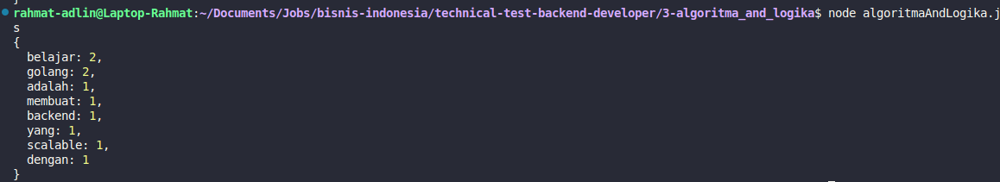

# Algoritma dan Logika

## Deskripsi
Program ini menghitung frekuensi kemunculan kata dalam sebuah teks. Program menggunakan JavaScript untuk memproses input dan menampilkan hasil perhitungan frekuensi kata.

## Input
```
"Belajar Golang adalah belajar membuat backend yang scalable dengan Golang"
```

## Cara Menjalankan

### Prerequisites
- Node.js (versi 12 atau lebih tinggi)
- Terminal/Command Prompt

### Langkah-langkah

1. **Buka Terminal/Command Prompt**
   ```bash
   cd 3-algoritma_and_logika
   ```

2. **Jalankan file JavaScript**
   ```bash
   node algoritmaAndLogika.js
   ```

### Output yang Diharapkan
Program akan menampilkan hasil perhitungan frekuensi kata dalam format object JavaScript:
```javascript
{
  belajar: 2,
  golang: 2,
  adalah: 1,
  membuat: 1,
  backend: 1,
  yang: 1,
  scalable: 1,
  dengan: 1
}
```

## Penjelasan Algoritma

1. **Input Processing**: Teks diubah menjadi lowercase untuk konsistensi
2. **Tokenization**: Teks dipisah berdasarkan spasi menggunakan regex `/\s+/`
3. **Cleaning**: Karakter non-alphanumeric dihapus dari setiap kata
4. **Counting**: Menggunakan `reduce()` untuk menghitung frekuensi setiap kata
5. **Output**: Menampilkan object dengan kata sebagai key dan frekuensi sebagai value

## Screenshot Hasil


## Struktur File
```
3-algoritma_and_logika/
├── README.md
├── algoritmaAndLogika.js
└── 4-algoritma_and_logika.png
```
